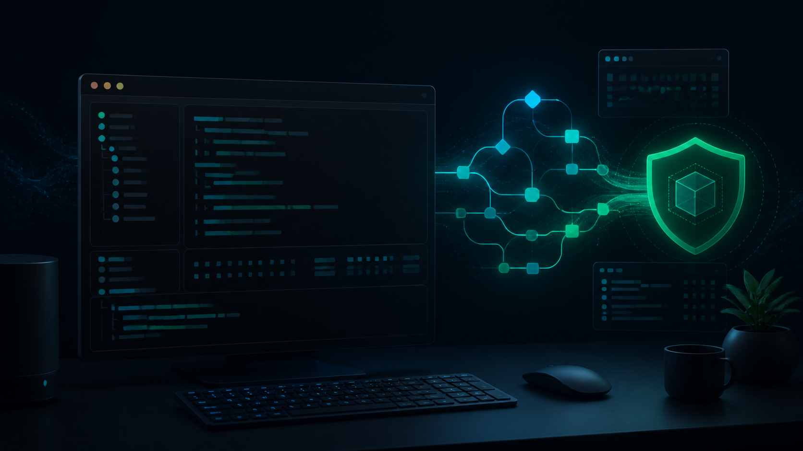
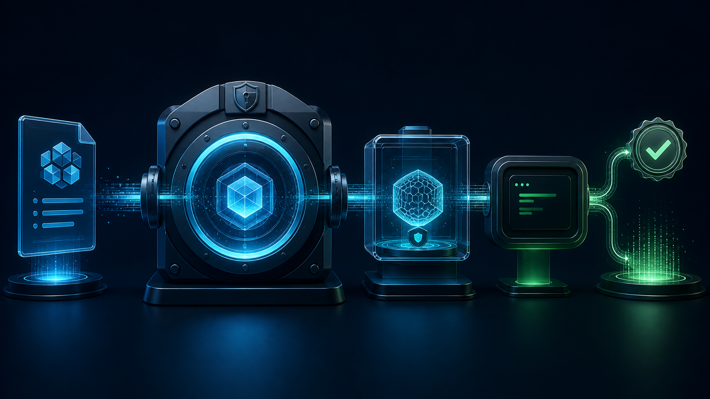

# the-harness

[](https://github.com/jordachmakaya/the-harness/actions/workflows/ci.yml)




> **A deterministic execution runtime for AI software engineering.**

`the-harness` turns multi-agent work into a verifiable local engineering pipeline. It separates planning from execution, confines every action to its authorized workspace, and treats an exit code, a test result, and a cryptographic seal as the only proof that a stage is complete.

Built for teams that need more than a black-box agent runner: repeatable execution, local data sovereignty, provider freedom, and evidence that survives review.

## Status

The CLI foundation is available: the executable builds and exposes standard help and version commands. The product capabilities below are the verified Z5 delivery roadmap; they are not represented as shipped commands until their modules, tests, and gates are sealed.

## Capabilities

| Capability                      | Product outcome                                                                                                                                   | Delivery state                  |
| ------------------------------- | ------------------------------------------------------------------------------------------------------------------------------------------------- | ------------------------------- |
| Deterministic stage engine      | Executes a `BuildContract.v1.json` through gated zones, where automated checks—not model claims—decide completion                                 | Planned                         |
| OS-level workspace confinement  | Prevents unauthorized writes with native Landlock, Seatbelt, or ACL boundaries and fails closed                                                   | Planned                         |
| Persistent terminal supervision | Owns PTY sessions, sanitizes ambient secrets, and terminates complete subprocess trees on timeout                                                 | Planned                         |
| Context preservation            | Spills tool output above 50 KB to local disk and deterministically prunes conversation history                                                    | Planned                         |
| Portable model access           | Normalizes streaming and token accounting across Claude, OpenAI, Gemini, DeepSeek, Antigravity, and local backends                                | Planned                         |
| Evidence and recovery           | Records local SQLite events, OpenTelemetry spans, SHA-256 seals, and recoverable session checkpoints                                              | Planned                         |
| Safe configuration              | Validates typed configuration through `@hardmachinelabs/zod-config` and synchronizes declared environment inputs with `@hardmachinelabs/env-sync` | Dependency foundation installed |
| Quality by construction         | Uses strict TypeScript, Vitest, mutation testing, architecture checks, and reproducible CI                                                        | Foundation available            |



## Why teams choose this model

- **Evidence over optimism.** A stage advances only after deterministic checks and sealed artefacts pass.
- **Local by default.** Session records, traces, spill data, and source mutations remain on the developer machine unless explicitly configured otherwise.
- **No provider lock-in.** Model access is designed as a normalized adapter layer, not as a single-vendor control plane.
- **Composable at the core.** A Cordis microkernel keeps runtime services and future plugins isolated behind explicit interfaces.

## Requirements

- Node.js 22 LTS (Node.js 20+ runtime compatibility is retained)
- PNPM 9.12.0

## Install and run

```bash
pnpm install --frozen-lockfile
pnpm build
node apps/cli/dist/index.js --help
```

The repository currently ships the CLI foundation. Published package installers and release binaries will be documented here when the first release is sealed.

## Commands

```text
the-harness --help     Show the available commands
the-harness --version  Show the installed version
```

Commands for sessions, sandboxing, terminal supervision, persistence, and model providers are introduced with their corresponding verified runtime modules.

## Develop from source

```bash
pnpm lint
pnpm test
pnpm build
```

Turborepo runs the workspace tasks. Dependencies are pinned centrally in `pnpm-workspace.yaml` through the PNPM catalogue.

## Workspace layout

- `apps/cli` — executable entry point
- `packages/client` — Next.js client foundation
- `pnpm-workspace.yaml` — shared dependency catalogue

The executable builds to `apps/cli/dist/index.js`.

## Configuration and security

Do not commit provider API keys. Use local environment variables or a platform keyring. The CLI will validate its configuration before connecting to providers; its configuration packages are centrally pinned in the PNPM catalogue. The repository ignores `.env` files and generated build artefacts by default.

Start from [`.env.example`](.env.example). `env-sync` is deliberately maintainer-operated: it can synchronize local values to GitHub secrets through an authenticated `gh` CLI session, so it must first be run with `--dry-run` and never from an untrusted pull-request workflow.

## Upstream inspiration and attribution

`the-harness` is independently implemented, while drawing architectural inspiration from [DeepSeek Harness](https://github.com/deepseek-ai/deepseek-harness). No DeepSeek Harness source files or assets are vendored in this foundation. If source code or substantial documentation from that project is imported later, its MIT copyright and permission notice must be retained with the imported material and recorded in [THIRD_PARTY_NOTICES.md](THIRD_PARTY_NOTICES.md).

## CI and releases

GitHub Actions uses Node 22 LTS and a frozen lockfile to run format, lint, an explicit test-suite job, build, architecture-boundary, duplicate-code, and production-dependency-audit checks. A separate scheduled security workflow runs CodeQL and repeats the production dependency audit. This repository does not deploy through Dokploy; that delivery target is reserved for the separate Cockpit UI project.

### Branch policy

| Workflow               | Runs on development branches | Runs for a pull request to `main` | Runs after merge to `main`        |
| ---------------------- | ---------------------------- | --------------------------------- | --------------------------------- |
| Continuous integration | Every `zone/**` push         | Yes                               | No — merge was already gated      |
| Security               | No                           | Yes                               | Yes, plus a weekly scheduled scan |
| Release                | Not configured yet           | No                                | Human-gated GitHub Release only   |

When `main` is protected, require the `Quality and build`, `Test suite`, `Architecture and duplication`, `CodeQL`, and `Production dependency audit` checks before merge. The release workflow remains intentionally absent until the package and signing policy are sealed.

## Contributing

Use a focused branch, run `pnpm lint`, `pnpm test`, and `pnpm build`, then include proof with your change. Do not commit secrets or generated artefacts.
